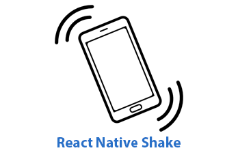

# React Native Shake Event Detector

[](https://badge.fury.io/js/react-native-shake)



With this library, you can add shake event detector on your React Native app. Because `react-native-shake-event` is not in active development anymore, I decided to created this.

Please note that it only works on *real devices*

## Installation

```sh
npm install react-native-shake
```

or

```sh
yarn add react-native-shake
```

## Linking the native modules

### Automatic:

From React Native 0.60, you don't have to manually link libraries anymore. Just

```bash
cd ios
pod update
```

and you're good to go.

### Manual (iOS):

Follow this [guide](https://reactnative.dev/docs/linking-libraries-ios)

## Usage

```tsx
import RNShake from 'react-native-shake';

// For v3.x.x and below:
class MyComponent extends React.Component {
  componentDidMount() {
    RNShake.addEventListener('ShakeEvent', () => {
      // Your code...
    });
  }

  componentWillUnmount() {
    RNShake.removeEventListener('ShakeEvent');
  }
}

// For v4.x.x onwards:
class MyComponent extends React.Component {
  componentDidMount() {
    RNShake.addEventListener(() => {
      // Your code...
    });
  }

  componentWillUnmount() {
    RNShake.removeEventListener();
  }
}
```